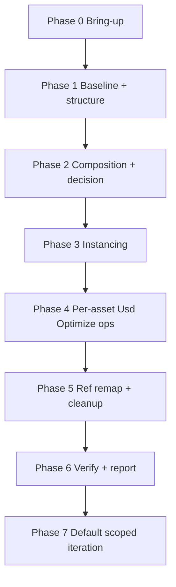

<!-- SPDX-FileCopyrightText: Copyright (c) 2026 NVIDIA CORPORATION & AFFILIATES. All rights reserved. -->
<!-- SPDX-License-Identifier: Apache-2.0 -->

# USD Performance Tuning Skill Map

> Compact navigation aid for the agent-facing catalog. Detailed phase
> choreography lives with the owning entry skill:
> `skills/omniverse-usd-performance-tuning/references/workflow.md`.

## Read me first

Use this map to enter the single public workflow skill and load only the next
necessary nested reference. Do not pre-read every reference.

- Start every public USD performance request in
  `omniverse-usd-performance-tuning`. There is one entry: the full
  optimize+validate pipeline. Validation, structuring, and individual ops are
  phases of that pipeline, not standalone entries — there is no validation-only,
  structure-only, or direct-op bypass.
- Route runtime ambiguity to `setup-usd-performance-tuning` unless a runtime
  path is already verified.
- Route `omniverse://` targets to `omniverse-authentication` before probing.
- Route an explicit render-profiling request (FPS / Hydra / RTX / VRAM /
  draw-call) to the opt-in Kit→omniperf profiling path (`profile-stage` full
  mode / `compare-profiles`). This is a profiling adjunct, never an alternate
  optimization runtime.
- Resolve Usd Optimize mechanics through upstream
  [usd-optimize](https://github.com/NVIDIA-Omniverse/usd-optimize/) or the
  prebuilt Usd Optimize release package (asset resolution:
  `references/upstreams/usd-optimize.md`) using
  `$USD_OPTIMIZE_ROOT`. If no package root exists,
  use the package path, URL, or extracted root supplied by the user. Current
  public direct archive URLs are listed in
  `references/upstreams/usd-optimize.md`. Do not clone the source repo just to
  read Usd Optimize operation docs.
- Read
  [the workflow reference](workflow.md)
  when the request needs the full Phase 0-7 optimization flow.
- Read
  [the report template](optimization-report/references/optimization-report-template.md)
  before Phase 0
  so every phase collects the fields needed by the final report.

## Catalog Surface

`skills.selected.txt` exposes exactly one public workflow skill.

| Selected skill | Purpose |
|---|---|
| `omniverse-usd-performance-tuning` | Top-level performance router and owner of the full workflow reference. |

## Nested References

These logical phases live under
`skills/omniverse-usd-performance-tuning/references/` and are loaded
only when their phase is reached:

| Reference | When loaded |
|---|---|
| `profile-stage` | Loaded by the workflow for baseline and after metrics. |
| `usd-hierarchy-dedupe-candidates` | Loaded when copied hierarchy or high mesh count suggests structure reuse. |
| `usd-mesh-fragmentation-candidates` | Loaded when a converter face-explosion (flat fan of anonymous same-material meshes under a named unit) suggests a within-prototype merge. |
| `restructure-decision` | Loaded for the Phase 2e user-confirm gate. |
| `apply-restructure` | Loaded for Phase 2f hierarchy rewrite and Phase 5 reference remap. |
| `instancing-readiness` | Loaded when the workflow finds candidate instances. |
| `usd-edit-target-planner` | Loaded when edits need a safe authoring target. |
| `usd-optimize-run-validators` | Loaded by validation routing for Usd Optimize validator execution. |
| `usd-optimize-interpret-validators` | Loaded to turn validator findings into operation recommendations. |
| `compare-profiles` | Loaded at Phase 6 to classify improvement, neutral, regression, or mixed outcomes. |
| `install-kit`, `install-usd-optimize-standalone`, `install-usd-optimize-standalone`, `install-usd-validation-nvidia-standalone` | Loaded only by setup dispatch. |
| `usd-optimize-create-proxy` | Specialty user-request reference, not part of the main optimization flow. |

Validation command references are owned by
`skills/omniverse-usd-performance-tuning/references/usd-validation-runner/references/` rather than top-level
skills.

## Boundary Decisions

- `usd-structure-assessment` stays the broad composition, layer, asset-boundary,
  and reuse assessment owner.
- `usd-hierarchy-dedupe-candidates` stays a separate downstream diagnostic
  reference. It is loaded only when assessment finds copied hierarchy, high mesh
  count, or likely reusable prototypes that need candidate grouping.
- `usd-mesh-fragmentation-candidates` is its merge-side counterpart: the
  hierarchy finder finds *repeated subtrees* to **instance**; the fragmentation
  suggester finds *fragmented same-material fans* to **merge**. A fan that is also
  a repeated subtree is instanced at the component, then merged inside the
  prototype — the two compose, they do not compete.
- `restructure-decision` stays a thin user-confirmation gate between assessment
  evidence and `apply-restructure`. Do not fold it into assessment unless the
  runtime scenarios still pass and the gate remains explicit.

## Workflow At A Glance

The detailed choreography, Kit/standalone branches, validator-stack matrix,
operation ordering, termination conditions, duration hints, and optional
iteration loop are in
[`workflow.md`](workflow.md).

## Reference Ownership

- Optimization workflow: `skills/omniverse-usd-performance-tuning/references/workflow.md`
- Runtime artifact/token policy:
  `skills/omniverse-usd-performance-tuning/references/runtime-artifact-token-budget.md`
- Validation routing: `skills/omniverse-usd-performance-tuning/references/usd-validation-runner/README.md`
- Validation command references: `skills/omniverse-usd-performance-tuning/references/usd-validation-runner/references/`
- Usd Optimize operation mechanics:
  [`usd-optimize`](https://github.com/NVIDIA-Omniverse/usd-optimize/) or the
  prebuilt Usd Optimize package (local handoff:
  `references/upstreams/usd-optimize.md`)
- Local operation routing metadata: `references/operations/operations.json`
  (routing fields + nested `curation` block) and `references/operations/README.md`
- Local Usd Optimize workflow policy:
  `skills/omniverse-usd-performance-tuning/references/usd-optimize-run-operations/`
- Structure-assessment subtopics: `skills/omniverse-usd-performance-tuning/references/usd-structure-assessment/references/`
- Output/edit-target policy: `skills/omniverse-usd-performance-tuning/references/usd-structure-assessment/references/usd-edit-target-planner/references/`
- Final report contract: `skills/omniverse-usd-performance-tuning/references/optimization-report/references/optimization-report-template.md` and
  the `optimization-report` reference's co-located `scripts/optimization-report.schema.json`

## Reference-reading Policy

Some workflow references are copied documentation snapshots. If a reference
has a `Canonical URL`, prefer the live URL when network access is available;
the local copy is a snapshot.

## Status Vocabulary

Every status token in this skill tree, with its owner. Do not invent new
tokens; spell enum values exactly as the schema does (underscores, not
hyphens).

| Token | Kind | Owner |
|---|---|---|
| `ready_to_plan` | plan-time decision | SKILL.md (Plan-time vs execution-time approval) |
| `approval_required` | apply-gate decision | SKILL.md + `usd-optimize-run-operations/references/operation-safety.md` |
| `blocked_missing_usd_optimize`, `blocked_missing_usd_optimize_operation` | Phase 0 blocked codes | `workflow.md` Phase 0 |
| `workflow_mode: full \| structural_only \| no_op` | report enum | `optimization-report/scripts/optimization-report.schema.json` |
| `verdict: improved \| neutral \| regressed \| mixed` | report enum | same schema (compare-profiles produces it) |
| `apply_authority: auto \| auto-within-tolerance \| intent-gated` | per-op class | `references/operations/operations.json` + operation-safety.md |
| `disposition: optimized \| skipped_zero_meshes \| skipped_user_declined \| blocked` | target coverage | optimization-report schema (`target_coverage.entries[]`) |

Phase 4.5 (layer cleanup after destructive in-place ops, `workflow.md`) is an
interstitial step inside Phase 4→5, not a top-level phase; it is intentionally
absent from the phase diagram above.
