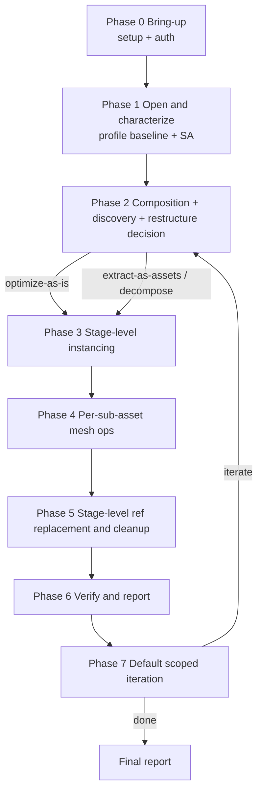

<!-- SPDX-FileCopyrightText: Copyright (c) 2026 NVIDIA CORPORATION & AFFILIATES. All rights reserved. -->
<!-- SPDX-License-Identifier: Apache-2.0 -->

# USD Performance Tuning Workflow

> Canonical phase choreography for the `omniverse-usd-performance-tuning`
> entry skill. Each downstream skill body remains authoritative for how to
> execute its phase.

---

## Read me first - JIT-loading directive

**Read this workflow after the compact `references/skill-map.md` routes an
optimization request here. Do NOT pre-read every skill or every reference.**

- Read a downstream nested reference only when you reach that phase.
- Read a `references/*.md` ONLY when this workflow or a phase guidance directs you to.
- The phase guidance below contains enough inline detail that you can start each phase without opening anything else.

The one exception: read `optimization-report/references/optimization-report-template.md` next, before starting Phase 0. It tells you which fields you must populate by end-of-flow so each phase can collect against the final data contract.

## Reference-reading policy

Each `references/*.md` file starts with a header block:

- If it has a **`Canonical URL`**, prefer the live URL when network access is available (the local copy is a snapshot).

## The 7-phase canonical flow

Seven in-flow phases (0-6) plus Phase 7. For broad "optimize this scene"
requests, Phase 7 defaults to 3 scoped iterations unless the user opts out,
asks for a quick pass, or stop criteria apply.

<!-- This milestone subsequence is duplicated in SKILL.md (Output Format).
     Keep the two lists character-identical. -->
For structured milestone lists, preserve this broad-optimization subsequence:
`omniverse-usd-performance-tuning` -> `profile-stage:baseline` ->
`usd-structure-assessment` -> `usd-validation-runner` ->
`restructure-decision` -> `apply-restructure` -> `usd-optimize-run-validators` ->
`usd-optimize-interpret-validators` -> `usd-optimize-run-operations` ->
`profile-stage:after` -> `compare-profiles` -> `optimization-report`.
Additional analysis skills may appear between these milestones only when they
do not reorder the subsequence.



### Phase 0 - Bring-up (runtime gate + auth)

Owner: `setup-usd-performance-tuning`; `omniverse-authentication` (only for `omniverse://`); `install-*` are downstream tools.

Do not duplicate the setup chooser here. Phase 0 means:

- Run the mandatory session-start gate from
  `setup-usd-performance-tuning/references/runtime-context-header.md`.
- If preflight is missing, invoke `setup-usd-performance-tuning`. That skill owns
  standalone setup (the sole optimize+validate runtime), version capture, and
  `setup-preflight.json`. Kit is not an alternate optimization runtime; it is
  retained only as an explicit opt-in render-profiling adjunct (Kit->omniperf).
- If the target is `omniverse://`, invoke `omniverse-authentication` before the
  first remote probe, open, validation, profile, or operation.
- Hand the resulting `runtime_context` and `operationsAvailable` list to later
  phases.

Phase 0 must complete before any other phase. The runtime choice changes how Phases 1a (profiling), 2c (validator commands), and 4 (op execution) execute. Other phases are runtime-agnostic.

#### Usd Optimize unavailable outcomes

If the standalone runtime cannot load Usd Optimize when the optimization
pipeline needs it, stop with `blocked_missing_usd_optimize`. If Scene
Optimizer is present but a pipeline step needs an op key absent from
`operationsAvailable`, stop with `blocked_missing_usd_optimize_operation` (the in-pipeline
op-availability cross-check — not a direct-op bypass). Do not silently substitute
a degraded path for an optimization request that requires Usd Optimize.

For broad optimization requests, if the standalone runtime has no loadable SO
library and the user declines install dispatch, the flow may continue in the
runtime-forced `structural_only` degraded mode (this is an honest runtime block
reported via `workflow_mode`, not a user-chosen bypass of the evidence/coverage
gates):

- Phase 1 runs as normal (SA + profile-stage quick-or-full).
- Phase 2a/2b/2d run as normal.
- Phase 2c runs the **pre-mutation USD stack only** (no Usd Optimize perf rules - they require Usd Optimize).
- Phase 2e: `restructure-decision` may still ask. `apply-restructure` needs a USD Python runtime for the hierarchy rewrite path.
- **Phase 3 still works** (instancing-readiness is pure USD); flips can be authored.
- **Phase 4 SKIPPED** (mesh ops require Usd Optimize).
- **Phase 5 SKIPPED** (no optimized children to remap).
- Phase 6: `profile-stage` AFTER + `usd-validation-runner` re-validation (pre-mutation USD stack only) + `optimization-report` with `workflow_mode: structural_only` (the `verdict` stays in its enum — `neutral` if no metrics changed) and a `notes` entry explaining that Usd Optimize operations did not run.

This is the path E2E test scenarios commonly hit.

### Phase 1 - Open and characterize the asset (two data channels)

Owner: `profile-stage` (1a) + `usd-structure-assessment` (1b). Both run; **order does not matter (sequential is fine - the agent does NOT need to spawn parallel processes)**.

```
1a  profile-stage:baseline        (runtime metrics)
       standalone (default): quick mode - stage open time only (no FPS, no VRAM)
       opt-in Kit->omniperf profiling adjunct: full mode - VRAM, FPS, frame time
         (Tracy-backed), only when the user explicitly requests render-time
         profiling. Standalone is the sole optimize+validate runtime; Kit is a
         profiling adjunct, never an optimization path (see Phase 0).

1b  usd-structure-assessment       (structural analysis - one umbrella)
       Same skill body in both runtimes. Produces ~25 facts including
       prim/mesh/material counts + phase_recommendation
       (structuring | optimization | already_optimized) + validation_scope
       + asset_boundary_suggestions + asset_physical_context.
       In Kit, the agent may augment with Usd Optimize analysis ops (printStats, etc.
       from references/operations/README.md) for finer-grained stats - this is
       not a separate phase step.
```

Structural analysis (SA, hierarchy hashing, and boundary/occlusion nomination) runs on a fully-loaded, fully-composed stage (all payloads loaded) so an enclosed sub-assembly behind a payload is visible rather than silently reading as empty.

Populate the baseline portion of `optimization-report/references/optimization-report-template.md` from 1a + 1b before moving on. When returning structured plans or runtime-test milestone lists, label this phase exactly `profile-stage:baseline`.

### Phase 2 - Composition, discovery, and restructure decision

Five steps (2a-2d) feeding the gate at 2e, plus optional 2f if the user chooses restructure.

```
2a  Composition structure analysis    (USE: usd-structure-assessment Phase 1.1-1.3 output)
       Classify: monolithic-needs-restructure | monolithic-fine-as-is | composed-and-how
       Identify explicit prototypes/scopes that can be targeted separately.

2b  Asset boundary inference          (USE: usd-hierarchy-dedupe-candidates + SA §2.5)
       Run hierarchy hashing for monolithic stages. Output is double-purpose:
       - Where to draw asset boundaries if we restructure
       - Stage-level instancing effectiveness signal
       SA's asset_boundary_suggestions field already promotes hash-aligned
       cut points.

2c  Whole-stage validation that informs the restructure decision   (USE: usd-validation-runner)
       Read `usd-validation-runner/README.md` before writing or running
       validator code. At 2c the runner runs only **Tier 1** (cheap whole-stage
       stats/probes) plus the minimum-openability/structural checks needed to
       classify the stage and feed the 2e gate — built from SA's summary_counts,
       phase_recommendation, and validation_scope.
       Per-target **Tier 2/3** validation does NOT run here: those validators
       belong on the post-restructure artifacts (prototypes, sub-assets, residual
       assembly root) and run inside the Phase 4 per-target loop, where their
       scope is one target/pair by construction. (A pre-restructure Tier 2/3
       diagnosis is available only on explicit user request.)
       Validators are named by canonical concept (validator-concepts.json) and
       executed via scripts/usd_validation_executor.py — never by bare class
       name or a hand-written script.
       Output: a compact scope note/artifact (validation-scope-note.schema.json)
       plus the Tier 1 findings corpus that informs 2e. (Tier 2/3 findings and
       their coverage_ledger are produced per target in Phase 4.)

       Large-stage guardrail: if resolved stage size is unknown or >100 MB,
       composed prim count is >10,000, mesh/prototype count is high, the target
       is customer-scale CAD/BIM/MEP/factory/plant/city, or the ask is
       performance optimization rather than formal conformance, do not run a
       default full-stage usd-validation-nvidia / Usd Optimize sweep. Ask before full sweep.

       Correctness precondition: include the selected `safety_gate`
       concepts with `backing_op: null` (dangling material bindings — including
       bindings whose target path sits under a stale/renamed root — missing
       refs, kind metadata; registry names: `material_dangling_binding`,
       `composition_missing_ref`, `kind_metadata`) in the 2c scope note and run them
       here, whole-stage. These are not report-only findings: a correctness
       defect POISONS the optimization evidence (observed on a large
       data-center assembly asset, where a high volume of dangling bindings made
       `material_duplicates` falsely return 0), so an
       unresolved safety-gate finding BLOCKS Phase-2e interpretation of the
       structural/material evidence until it is waived or repaired. Repair (when
       chosen) is one whole-stage bespoke USD-authoring rebind via the
       open-reasoning mode (Sdf/pxr, owned by `apply-restructure` — not an SO
       op), authored BEFORE structuring so the defect is never replicated into
       prototypes/instances; it is intent-gated (surfaced with trigger +
       hypothesis, applied on confirmation, written to a new file, source
       untouched — detection != mandatory repair). Re-verify the same concepts
       after structuring on each externalized node (restructure can introduce
       new dangling bindings). This detection sweep is mandatory-early but still
       cost-bounded: it does NOT inherit Tier-1's no-timeout exemption — run it
       in a killable subprocess under a wall-clock budget, and above the
       large-stage threshold degrade to a masked spot-check (>=25% mesh-bearing
       coverage) rather than a full traversal, recording a `sampled` /
       `timeout_recorded` disposition.

2d  Stage-level instancing assessment   (USE: dedupe-candidates output from 2b)
       For composed stages: are existing references actually instanceable?
       For monolithic stages: how much repeated content is there, and how much
       leverage would instancing give us?

2e  Restructure decision GATE              (USER-CONFIRM)
       Owner: restructure-decision
       Inputs: SA classification (2a), boundary signal (2b), validator
       findings (2c), instancing assessment (2d).
       Branches (the gate chooses HOW to optimize, never whether to — every
       branch proceeds into the optimization pipeline; there is no
       no-optimize/diagnose-and-exit choice):
         - monolithic & restructure recommended & dedupe candidates -> ASK USER:
              deduplicate-internally (apply-restructure internal_reference:
                direct value-hash nested-library authoring)
              / extract-as-assets (apply-restructure external_prototype)
              / optimize-as-is
         - monolithic & restructure recommended & no dedupe -> ASK USER:
              decompose-for-selective-loading | optimize-as-is
         - monolithic & fine as-is             -> continue (no restructure)
         - monolithic & fine as-is + payload_count=0 + clear boundaries
              -> ASK USER:
              decompose-for-selective-loading / optimize-as-is
         - composed                            -> continue (assess existing
                                                  instancing per Phase 3)
         - already_optimized                   -> continue (Phase 3-5 find no
                                                  work; report workflow_mode:
                                                  no_op, verdict: neutral)

2f  If extract-as-assets, deduplicate-internally, or decompose-for-selective-loading
                                              (USE: apply-restructure mode=restructure)
       Orchestrates the USD-authored hierarchy rewrite (pxr/Sdf Python). See
       usd-structure-assessment/references/apply-restructure/README.md
       Workflow - mode=restructure. The chosen branch sets `dedupe.mode`:
         - extract-as-assets / decompose-for-selective-loading →
           `external_prototype`: materialize one prototype USD per group to disk
           and rewrite refs (payloaded, independently loadable).
         - deduplicate-internally → `internal_reference`: author internal shared
           prototypes DIRECTLY via the value-hash nested-library rewrite (internal
           refs marked instanceable=true); the stage stays a single monolithic
           file (no external payloads).
       Either branch is a direct USD-authored rewrite, NOT an SO
       deduplicateHierarchies invocation. On usd-optimize 1.0.x that operator
       DOES author instanceable internal references, nested on 1.0.4 (verified 2026-06-11:
       a 222,513-prim CAD stage collapsed to 21,030 composed prims / 2,663
       prototypes in 46 s, default args) — but it produces no restructure-role
       manifest, frontier/identity gating, or `kept_inline_for_merge` tagging,
       which this phase's contract requires (see restructure-decision/README.md
       "When hierarchy_dedupe.recommended=true").
       Output: restructured stage ready for Phase 3.

2g  Bounded recursive descent — Phase 2 is a bounded DESCENT, not a
    single gate. After 2f extracts assemblies, re-run boundary inference
    (2b §2.5) on EACH extracted asset to find component, then subcomponent
    boundaries, repeating 2b→2e per node to a bounded depth.

    Target-tree tags (the spine the whole flow hangs off; carried in the
    apply-restructure manifest `phase4_targets[]` and consumed by Phase 4):
      - level: assembly | component | subcomponent  (= USD `kind`) — drives the
        STOPPING RULE.
      - importance / articulated: descend to `subcomponent` ONLY for "important"
        sub-hierarchies (articulated / physics / variant-bearing). Articulated
        assets instance at RIGID-BODY / LINK level and reassemble through
        references (factory guide Step 4) — never whole-asset instancing.
      - archetype: large-spatial(architecture) | encapsulated-product | piping |
        generic — derived from `semantic_label` + structural signals; selects
        which Phase-4 op-chain steps apply.

    STOPPING RULE: descend while there are dedupe/semantic boundaries AND
      (level < component OR the node is "important"); otherwise STOP. The depth
      bound caps layer COUNT — over-structuring (the over-structuring pitfall)
      is a failure even with packaging deferred (over-structuring on factory-scale
      VFI assets has produced layer counts in the five figures).

    CONVERGENCE GATE (confirm per level; bottom out before Phase 4): the per-node
      STOP says why ONE node stopped, not that the whole descent converged — and
      how deep to decompose is the USER's call (restructure-decision is the
      per-level confirm gate), not an autonomous plunge. After authoring a level,
      RE-RUN the reuse analyzer (the cheap HASH_LEVEL-2 pass), PRESENT the new
      shareable groups it finds one level down (above the floor: MINP, occurrence
      >=2) with the addressability / layer-count cost, and ASK whether to descend
      or stop. The asks that matter: crossing a named identity boundary and any
      identity-destroying route (point-instance / merge); a routine lossless tail
      can be auto-finished on opt-in. COMPLETE = user stopped, OR re-scan dry above
      the floor (residue = sub-MINP kept_inline_for_merge / split value-variants /
      unique). Do NOT proceed to Phase 4 geometry ops (decimation, within-prototype
      merge) until complete; record frontier.descent_converged +
      final_rescan_new_groups_above_floor. Reducing/merging an unconverged structure
      wastes work on geometry further sharing would collapse, and a merge that runs
      before its kept_inline_for_merge leaves are reserved fuses already-shared
      geometry (premature-merge inflation: triangles + disk inflate, and the
      report's preservation gate discards the result).

    SHARE, DON'T SCATTER (hard constraint, same default as the
    lossless-dedupe contract): externalization MUST prefer the dedupe/instancing
    path — shared prototypes with `instanceable=true` references — NOT N
    independent per-node payloads as the reported win. Unique per-node payloads
    are valid only when the goal is explicit selective loading / authoring
    separation, and then the report must call out the load-time / layer-count
    tradeoff instead of presenting the split as the optimization. A USDC/crate
    repack or an unshared disaggregation is NOT an optimization win — the Phase-6
    gate fails closed on it (see footprint contract + optimization-report). The
    depth bound caps layer count; sharing caps load time and memory.
```

#### The structure model the descent is serving (read before deciding a frontier)

The descent's job is not "make the number smaller." It is to land an asset whose
**named parts stay findable, selectable, and serviceable**, with zero broken
bindings — the cleanest structure a careful USD author would recognize, not the
smallest prim count. Five ideas govern every boundary call; they are the decision
context behind the mechanical rules above.

1. **Three axes move independently — never conflate them.** *Correctness* (same
   geometry present, materials bind, bounds intact) is non-negotiable and gates
   first. *Scene-graph weight* (prims to compose / walk) is what sharing reduces —
   a runtime/memory win. *Disk size* is mostly distinct geometry + primvar bytes.
   The trap: collapsing duplicates into instances makes the scene graph lighter but
   frees **~no disk**, because the crate already byte-dedupes identical arrays
   within a layer (OpenUSD content-reuse guidance: *"a USD file with 1000 identical
   meshes might only be marginally larger than a file with a single copy"*). So a
   drop in *summed* points/prims across the stage is a **reuse** result, not a
   geometry or disk result — report it as scene-graph, never as a disk win. What
   *does* move disk is changing stored bytes: removing genuinely-unused data (an
   unused UV set is often the single largest lever), primvar indexing, layer
   consolidation, and lossy reduction. A lossless disk win is **not** suspect;
   silent loss is caught by the preservation gate, not by the disk number.

2. **Find boundaries by identity first; let reuse only confirm.** Recover the real
   units in priority order — authored `kind` (`assembly`→`group`→`component`→
   `subcomponent`), then meaningful naming (`assetInfo` / display name / variant
   set; `Mesh_017` or a bare transform `Xform` is plumbing), then semantic
   real-world recognizability (does a domain expert name this as one serviced /
   catalogued / swapped piece?). Only then hierarchy-hash the **already-meaningful**
   candidates to learn which repeat and how exactly. Hashing **confirms reuse; it
   does not define the grain.** Letting the hash choose the grain is exactly the
   failure that over-shares at the mesh level and dissolves every part's identity.
   Where authored identity is entirely absent, structure may *propose* the
   **coarsest repeating subtree** as a fallback grain (flag `grain_source =
   structural_fallback`) — still never the individual mesh.

3. **Share at the coarsest unit that captures the reuse — the named subcomponent,
   never the mesh.** Mesh-level sharing produces enormous anonymous arc counts
   (orders of magnitude more arcs than sharing at the subcomponent level, for
   comparable prim reduction) and throws away addressability. Reuse recovery may then justify descending to finer
   *named* subcomponents (the variant-outlier and unique-container cases), but never
   into meshes.

4. **Author nested, not flat.** Define small parts once; have parent prototypes
   **reference** child prototypes rather than inlining copies. Flat/outermost
   extraction just moves the duplication into the new files and makes the package
   *bigger*; a bottom-up nested library is what keeps the multi-file premium
   recoverable.

5. **Repair correctness first, and read the structure you already have.** Fix
   content defects (dangling bindings) before structuring — instancing a broken
   part replicates the breakage, and a defect *poisons the optimization evidence*
   (a stale-root rebind can flip a falsely-`0` `material_duplicates`). And many
   inputs arrive *already partway down* the hierarchy (already-instanced or BIM/CAD
   exports with authored prototypes and `kind`): **resume the descent from the level
   the asset is already at**, treat existing prototypes as the candidate set there
   (collapsing byte-identical-but-separately-authored prototypes), and **measure the
   remaining reuse before promising any consolidation win**. When measured reuse is
   low (parametric MEP-style geometry where each run differs), the value pivots to
   the **disk tier** (unused-primvar removal, primitive-fit, decimation) rather than
   forced sharing.

The identity × reuse disposition matrix that informs the per-unit calls
(externalize / internal-share / keep-local, and the reduction routes) lives in
`usd-structure-assessment/references/instancing-readiness/references/instancing-tradeoffs.md`.

**The descent is a bounded loop, and the manifest enforces it (not just prose).**
The frontier scan is an upfront whole-stage pass bounded the **same way the
correctness sweep is** — wall-clock budget, killable subprocess, masked spot-check
above a size threshold; when it degrades it records `frontier_estimate_basis =
spot_check` and still produces a bounded, completed plan (no hang). The loop
**stops at the minimum meaningful named unit** and descends past it only for a
**variant-outlier** (share the identical majority, recurse into the differing
branches) or a **unique container of shared children**; it records the **arc count
against the distinct data reused** (not arcs alone) as the too-deep signal, and it
**resumes from the level the asset is already at** (`descent_level` /
`frontier.descent_entry_level`). The deterministic disposition step is shipped as
`usd-structure-assessment/references/usd-hierarchy-dedupe-candidates/scripts/select_frontier.py`; its output drops into `phase4_targets[]` and is
checked by `validate_manifest_structure`, which **fails** a descent that lands a
shared frontier on **anonymous meshes** (`identity_signal: none`), an
**identity-destroying route** (`point_instance` / `merge`) on a **strong-identity**
unit, or a **consolidation claim without measured reuse** — so a bad descent fails a
contract rather than slipping through.

### Phase 3 - Stage-level scene-graph instancing

Owner: `instancing-readiness` (per-candidate gate); `usd-edit-target-planner` (where to author the flips, includes absorbed variant/payload gates).

```
3a  Enumerate instancing candidates:
       - For composed stages: existing references identified in 2a/2b
       - For restructured stages: the new prototype/reference structure from 2f
       - For monolithic-fine-as-is: any explicit instances or prototypes from 2a

3b  For each candidate:
       Run instancing-readiness gate:
         safe                -> mark instanceable=true
         overrides_found     -> skip (would create unnecessary prototype)
         variant_divergence  -> skip or escalate

3c  Choose edit target for the flips      (USE: usd-edit-target-planner)
       Override layer | per-asset edit | processor output | source repair
       Variant/payload gates are inline in the planner.
       For merge safety questions, see `usd-structure-assessment/references/instancing-readiness/references/instancing-tradeoffs.md`.
```

### Phase 4 - Per-sub-asset mesh-level optimization

Owner: `usd-validation-runner` (per-target Tier 2/3 validation on each restructured artifact) -> `usd-optimize-interpret-validators` (build op chain from that target's findings) -> `usd-optimize-run-operations` (single-asset driver; agent orchestrates per-target invocation per the "Agent-orchestrated batch mode" section in that skill body; adaptive concurrency by resource budget; prototype-first ordering).

Phase 4 is the per-target **validate → interpret → operate → re-verify** loop.
Tier 2/3 validation runs here — scoped to one `phase4_targets[]` entry (or one
flagged cross-component pair) at a time — not as a pre-restructure whole-stage
sweep. This is the primary validation model for per-target/per-pair concepts;
see the "Post-Restructure / Post-Decompose Validation Strategy" in
`usd-validation-runner/README.md`.

```
4a  Enumerate optimization targets (1..N):
       - After restructure: each new prototype, shared layer, or loadable
         sub-asset from Phase 2f's `apply-restructure-manifest.json`
         `phase4_targets[]`, PLUS the remaining assembly root itself (it
         may still contain mesh data — ground planes, shared environment
         geometry, non-extracted sub-hierarchies). If the assembly root has
         0 mesh prims after extraction (pure Xform/reference hierarchy),
         skip it but log the skip decision.
         Consume every `phase4_targets[]` entry; do not filter the manifest
         down to prototype paths. An `assembly_root` target with retained
         meshes is a mesh-optimization target, not a stage-cleanup-only target.
       - Composed stage:    each referenced asset from Phase 2a
       - Monolithic-as-is:  the monolith itself (N=1)

4b  Adaptive parallelism (agent-orchestrated; not a driver flag):
       - Do not serialize independent targets by default.
       - Group targets by dependency: shared prototypes/layers first,
         then dependent non-prototype targets.
       - Choose initial concurrency from target weight and system resources
         (file size, mesh/vertex/material counts, op-chain cost, CPU/RAM/VRAM,
         disk and log headroom).
       - Run a pilot batch, inspect resource pressure and failures, then
         increase/decrease concurrency for the next batch.
       - Run targets through `usd-optimize-run-operations/scripts/run_batch.py`; the scheduler owns
         subprocess spawning, per-target/per-op timeout, dependency ordering,
         status.json, and `--resume`.
       - Pause only when observed runtime/resource budget says continuing
         automatically is unsafe; resume from status.json rather than inventing
         a one-off continuation mechanism.

4c  Per-target validate → op chain (Tier 2/3 validation + usd-optimize-interpret-validators):
       Honor prototype-first ordering: prototypes BEFORE non-prototype targets
       so changes propagate. For every mesh target — each prototype, then each
       non-prototype target, including an `assembly_root` target when it retained
       local meshes:
         1. Run that target's selected Tier 2/3 validators scoped to the target
            (per usd-validation-runner). Open the target file standalone, or
            `OpenMasked` over the relevant subtrees for a flagged cross-component
            pair; Tier 3 runs per flagged pair. Record the per-target
            coverage_ledger.
         2. Build the evidence-selected op chain from THIS target's findings via
            usd-optimize-interpret-validators, then split it by apply authority. Each op's
            BASE class is the machine-readable `apply_authority` field in
            `references/operations/operations.json` (`auto` /
            `auto-within-tolerance` / `intent-gated`); read it from the catalog
            rather than restating a per-op list here. The meaning of each class,
            the inline-elicited vs purpose/identity-gated split within
            intent-gated, and the **target-conditional** functional-tolerance
            downgrade (which the static field deliberately does not encode) are
            owned by usd-optimize-run-operations/references/operation-safety.md "Apply
            authority: auto vs intent-gated routing". Apply that split by
            iteration:
              - **auto (lossless)** ops run now, per target, no prompt.
              - **intent-gated** ops are NOT applied in this iteration. Collect
                their candidates and carry them to the Phase 7 iteration-2 opt-in
                menu. Exception: the inline-elicited intent-gated ops may be
                offered in-plan via their fidelity/intent prompt.
       Stage-level cleanup comes later; it does not replace mesh operations for
       geometry left in the assembly.
       **Internal-geometry removal is intent-gated** (the agent cannot know whether
       the twin needs its internals): the scoped findOccludedMeshes probe runs here
       in Phase 4 like any other scoped Tier 3 probe — no approval — producing the
       occluded-prim candidate list and its quantified impact; only the removePrims
       deletion is intent-gated, carried to the Phase 7 iteration-2 opt-in menu and
       run FIRST among that target's applies when opted into.
       Use usd-optimize-run-operations/references/config-from-evidence.md for
       evidence-to-config routing and
       usd-optimize-run-operations/references/operation-safety.md for confirmation
       policy before mutation.
       Prefer meshCleanup for vertex welding; reach for standalone
       mergeVertices only when the user explicitly needs that
       upstream-documented behavior — the op mechanics and the
       meshCleanup.mergeVertices parameter live upstream, resolved via
       `references/upstreams/usd-optimize.md`.
       **Within-prototype mesh merge (`merge` / Merge Static Meshes) is a
       first-class step here, not a "someday" option.** When a `phase4_targets[]`
       entry carries a `merge` disposition (the sub-MINP weak/none-identity inline
       leaves the descent kept local rather than sharing — e.g. loose bolts,
       brackets, fasteners under one prototype), run `merge` INSIDE that prototype
       (merge once, benefit N instances), never across an instance boundary.
       Order it right AFTER occluded-geometry removal and AHEAD of the
       `meshCleanup → deduplicateGeometry → computeExtents` tail, as
       `merge → vertex-weld-where-contiguous → computeExtents`. It is **intent-gated**
       (it destroys per-part addressability) and **bounded-loss**: like other
       intent-gated ops it is collected for the Phase 7 opt-in menu unless
       inline-elicited. Its payoff is a **prim-count / scene-graph reduction**
       (cheaper stage-open + composition/traversal + per-prim memory, plus fewer
       draw calls) — it is NOT a disk win (bytes ~= sum; the crate already
       byte-dedups). Apply the merge-eligibility guard (weak/none identity only;
       bounds-coherence ceiling) and the full op-chain from
       `usd-structure-assessment/references/apply-restructure/references/hierarchy-dedupe-rewrite-tool-spec.md`
       §9 before fusing. **Group the fan by the `(scope × material) key`:** within
       the merge boundary (the nearest named/`kind` ancestor, preserved), fuse the
       same-material meshes into one `Mesh` per material; when materials must
       coexist in one prim, fuse into one `Mesh` with a per-material
       `UsdGeomSubset` (familyName `materialBind`) so every binding survives — and
       stop merging when the per-subset overhead approaches the per-mesh overhead it
       replaced. The detailed grouping/execution mechanic and the archetype-gated
       merge depth live in
       `usd-structure-assessment/references/apply-restructure/references/mesh-merge-rewrite-spec.md`;
       the cheap suggester that surfaces these fans is
       `usd-structure-assessment/references/usd-mesh-fragmentation-candidates/`.
       Emit `merge_applied`, `rendered_mesh_merged_count`,
       `prototype_rendered_mesh_delta_pct`, `merge_identity_class`,
       `merge_bounds_coherence`, and the merge silent-loss invariant
       `rendered_triangle_count` (a re-pack preserves every face; mesh count and
       point count legitimately change, renderable triangles must not) into the
       optimization report so the merge earns scene-graph credit and is guarded
       (preservation + bounds) by the report gates.
       Honor the ordering invariants in the "Operation ordering invariants"
       section below (merge caveats: never if instanced/streaming).
       Save each optimized output to a NEW path (don't overwrite source).

4d  Per-target re-verify (captures this target's before/after)
       Re-run the target's selected validators on its optimized output to catch
       regressions before stage assembly, and record the per-target before/after
       in the coverage_ledger. This is the post-restructure norm: validate each
       target/pair independently; never re-compose and sweep (see the
       "Post-Restructure / Post-Decompose Validation Strategy" in
       usd-validation-runner/README.md). Phase 6 keeps only the Tier 1
       whole-stage before/after for the fair stage-level comparison.

4e  Target completion gate (machine-checked; mirrors the validation
    coverage_ledger):
       Record each Phase-4 target in the optimization-report's top-level
       `target_coverage.entries[]` with `path`, `role`, the default-predicate
       `mesh_count`, and a `disposition`
       (optimized | skipped_zero_meshes | skipped_user_declined | blocked).
       Use the restructure roles (assembly_root | prototype | shared_layer |
       loadable_subasset) after a restructure, and `monolith` for a
       non-restructured optimize-as-is target (N=1).
       `target_coverage.complete` is true only when every entry is resolved
       (the first three dispositions); a `blocked` or absent target keeps it
       false and the report is not final. A no_op / optimize-as-is run
       with no Phase-4 work is valid with `entries: []` and `complete: true`.
       The report author cannot self-attest coverage of a target that was never
       enumerated, so the gate reconciles against the manifest(s). Reconciliation
       is NOT optional once a restructure happened: whenever any entry has a
       restructure role, record the source manifest(s) in
       `target_coverage.source_manifests[]` (one per iteration). The gate
       auto-loads them — and also accepts `--manifest` — and fails closed if a
       restructure report has none:
         python3 optimization-report/scripts/validate_report.py <report.json> \
           [--manifest <iter1 apply-restructure-manifest.json>] \
           [--manifest <iter2 …>]
       The final report MUST cover the UNION of every iteration's
       `phase4_targets[]` (a target listed in iter-1 but dropped from iter-2's
       manifest is still owed coverage), `skipped_zero_meshes` is accepted only
       when the manifest's authoritative `mesh_count` is 0, and any uncovered or
       unresolved target exits non-zero. This is the gate that catches a
       retained-mesh `assembly_root` left un-optimized. A `monolith`-only run
       needs no manifest.

Runtime:
  standalone only: ops run via the selected SO Python API or standalone wrapper.
  (Standalone is the sole optimize+validate runtime; the opt-in Kit->omniperf
  path is render profiling only and never runs operations.)
  All Python scripts follow usd-optimize-run-operations/references/invocation.md; do not
  pass plain pxr.Usd.Stage objects directly to Usd Optimize operation APIs.
```

### Phase 4.5 - Layer cleanup after destructive in-place ops

Follow `usd-structure-assessment/references/usd-edit-target-planner/references/output-saving.md`.
After destructive SO edits, write cleaned layers with a **compacting
`Sdf.Layer.Export(<tmp_path>)` + atomic replace**, then update the new root's
sublayers/references to point at those cleaned paths. `Export` recompresses and
**garbage-collects** the layer, dropping arrays orphaned by dedup/cleanup;
**do not use `layer.Save()`** here — `Save()` appends without GC-ing
dedup-orphaned arrays and silently grows the file even as content shrinks.

Do **not** use `stage.Export()` here unless the user explicitly wants a
flattened deliverable. This cleanup step re-emits individual layers.

The disk-size deltas reported in Phase 6 are only meaningful after this
cleanup pass, and must be attributed against a **repack-normalized baseline**
(the input losslessly re-crated to the same encoding, zero dedupe) so the free
crate re-encode is split out from the structural win — never present a repack as
the optimization. See `optimization-report/README.md § Footprint attribution`.

### Phase 5 - Stage-level reference replacement and cleanup

Owner: `apply-restructure` (mode=ref_remap). Same skill as Phase 2f - both phases are USD ref-rewriting. See usd-structure-assessment/references/apply-restructure/README.md Workflow - mode=ref_remap (Phase 5).

```
5a  Compute the impact set:
       For each optimized sub-asset from Phase 4, find every parent assembly
       that references it (recursively up the composition graph until reaching
       a stage root).

5b  Recursively copy and rewrite:
       For each parent assembly in the impact set, copy to a new path and
       rewrite its references to point at the optimized children. Repeat
       up the chain until the root stage has an optimized variant.

5c  Stage-level cleanup ops (now safe - references are stable):
       computeExtents, residual deduplicateGeometry on remaining unique
       content, final pruneLeaves, removePrims of nothing-references.

5d  Output: an "optimized stage root" path the user can open and verify.
```

### Phase 6 - Verify and report

```
6a  profile-stage:after (same mode as baseline)

6b  Re-validate via usd-validation-runner: re-run the Tier 1 whole-stage
    stats/probes that ran in Phase 2c so the stage-level comparison is fair.
    Per-target Tier 2/3 before/after was already captured in Phase 4 (4d); do
    not re-compose and sweep to reproduce it.

6c  compare-profiles                                  (verdict: improved | neutral | regressed | mixed)
       If regressed > 5%:    warn
       If regressed > 20%:   critical, recommend revert/halt

6d  optimization-report (final step of in-flow phases; honors the skill's
    existing "final step" contract).
       Populate against the optimization-report schema (`scripts/optimization-report.schema.json` within that reference). Match
       optimization-report/references/optimization-report-template.md. Include baseline metrics
       (Phase 1a/1b), after metrics (Phase 6a), all operations performed
       (Phase 4 + Phase 5), all validator findings (Phase 2c + Phase 4 + Phase 6b),
       output_path = optimized stage root from 5d.
       On ANY run that makes a reuse / instancing / dedupe claim, also populate
       the `structural_summary` core scene-graph fields the report gates read:
       `reuse_measured` (true ONLY when the collapsed reuse was
       MEASURED — distinct vs total prototypes/units — never estimated),
       `authored_prim_delta_pct` (the primary scene-graph metric, negative =
       reduction), `unique_prototype_count`, and `instance_ratio`. These are the
       documented producer fields for scene-graph credit; emit them alongside
       the Phase 4c merge sub-fields. Report scoring awards NO scene-graph
       credit for an unmeasured (`reuse_measured` != true) or unemitted reuse
       claim, so a real dedupe that omits these scores zero on that axis.
```

When returning structured plans or runtime-test milestone lists, label Phase 6a
exactly `profile-stage:after`.

### Phase 7 - Iterate (default 3 scoped passes, post-report, agent-orchestration only)

```
7a  Compute "untapped options" - the diff between what was done and what could
    have been done. Examples:
       - Intent-gated ops collected but not applied in Phase 4 (which ops are
         intent-gated: operation-safety.md "Apply authority")
       - Inline-elicited lossy ops offered but skipped
       - Within-prototype `merge` collected in Phase 4 (intent-gated) but not
         yet opted into, or held back due to instancing concerns
       - Restructure declined at Phase 2e
       - Phase 4 scheduler paused remaining sub-assets due to resource budget;
         resume state recorded in status.json
    These are NOT a report footnote: present the intent-gated ones as a
    **batched per-asset opt-in menu** (operation-safety.md "Apply authority"),
    each with win AND loss quantified per asset (see that section for the menu
    format). The user picks per asset.

7b  Default to 3 optimization iterations for broad "optimize this scene"
    requests unless the user opts out, asks for a quick pass, or the run reaches
    a `no_op` / runtime-forced `structural_only` terminal state. Each iteration
    writes an interim report/update before the next begins.

7c  Iteration 1 follows the normal Phase 0-6 flow but applies **auto (lossless)
    ops only** — unattended-friendly safe wins, no prompts; this is the primary
    reported win, gated behind the whole-stage correctness precondition.
    **Default mild bounded-loss pass:** by default at least one Phase-7 iteration
    applies the **`auto-within-tolerance`** ops — every `bounded-loss` op with a
    deviation parameter at the *conservative* per-target scale band — for
    **visually-toleranced** targets (`large-spatial` / `encapsulated` /
    `generic`), with a one-line notice (not a prompt). This guards against
    under-optimization (the over-tessellated mesh a pure opt-in menu lets sail
    through). It does NOT apply to targets carrying a functional-precision signal
    (articulated / physics / sim-ready / metrology / variant-bearing), where the
    same ops stay intent-gated. Iteration 2 presents the **intent-gated opt-in
    menu** (7a) — above-band bounded-loss and identity-losing ops — and applies
    only what the user selects, per asset; it **reuses the scoped probe evidence
    already gathered in Phase 4** and runs only the selected destructive apply —
    detection is not re-deferred to here. (If a candidate type's detection
    genuinely was not run earlier, its scoped probe runs now, before the apply.)
    The three apply-authority classes (auto / auto-within-tolerance /
    intent-gated) and the functional-tolerance gate are owned by
    operation-safety.md "Apply authority"; the per-target bands by
    usd-optimize-run-operations/references/units-and-tolerances.md. Later iterations are
    lighter scoped passes: reuse prior SA/profile/validation evidence and run only
    targeted/delta probes needed to choose the next op set.

7d  Loop back to the relevant phase (typically Phase 4 with new per-target
    validation + ops; Phase 2c only when a fresh whole-stage Tier 1 signal is
    needed). Keep baseline metrics from the FIRST pass (don't re-baseline).

7e  Stop before iteration 2 or 3 if no useful untapped options remain, the
    previous pass regressed materially, the user opted out, or the next pass
    would only repeat work.
```

Phase 7 is a default three-pass posture for broad optimization, not permission
to run three full workflow reruns. Later passes are expected to be cheaper
because they reuse evidence and narrow scope. Revalidation in iterations is
same-or-narrower by default; expanded validation scope, whole-stage Tier 3
sweeps, full sweeps, or newly destructive operations require explicit user
approval. Always compute the "untapped options" list for transparency in the
report, even if the user opts out.

## Validator-stack matrix

The `usd-validation-runner` reference is the master router. It owns tier 1/2/3
detail, selected-probe planning, full-sweep approval, JSON plan shape, and
scene-aware adjustment rules.

### Pre-Mutation USD Stack

Owned by `usd-validation-runner`. The package keeps only two local validation
contracts here: the inline minimum-openability check and the
`validate-usd-validation-nvidia` reference. External profile/package validators
such as SimReady are deliberately outside this package and should be invoked
only through their owning workflow when the user explicitly asks for them.

### Performance stack (scoped)

`usd-validation-runner` selected plan -> `usd-optimize-run-validators` -> `usd-optimize-interpret-validators`.

### Phase-aware subset

Owned by `usd-validation-runner/README.md`. Summary:

- `structuring` → minimum-openability + targeted usd-validation-nvidia blockers only.
- `optimization` → **2c:** minimum-openability + scoped usd-validation-nvidia + Tier 1 cheap
  whole-stage stats/probes. **Phase 4 (per target):** Tier 2 on each target and
  Tier 3 on each flagged cross-component pair, scoped by construction — no
  full-stage default; whole-stage Tier 3 is a bespoke user request only.
- `already_optimized` → minimum-openability + scoped usd-validation-nvidia + Tier 1 cheap whole-stage stats/probes only.

## Operation ordering invariants

These are local workflow-ordering invariants. Usd Optimize operation
mechanics, parameters, and defaults live upstream in
[usd-optimize](https://github.com/NVIDIA-Omniverse/usd-optimize/); resolve the
checkout through `references/upstreams/usd-optimize.md`.

- **`findOccludedMeshes` + `removePrims` FIRST** — remove internal geometry
  before spending compute on anything else. Why clean, dedupe, or decimate
  meshes you're about to delete?
- `findOccludedMeshes` + `removePrims` BEFORE `meshCleanup`.
- `findOccludedMeshes` + `removePrims` BEFORE `deduplicateGeometry`.
- Structure and hierarchy rewrites complete before mesh-level optimization; use
  `usd-hierarchy-dedupe-candidates` + `apply-restructure` before mesh-level
  `deduplicateGeometry`.
- `meshCleanup` BEFORE `decimateMeshes`.
- `deduplicateGeometry` BEFORE `decimateMeshes` — **with the instancing caveat**:
  `deduplicateGeometry`'s default `duplicateMethod` (Instanceable Reference, 2)
  replaces duplicates with instances, and `decimateMeshes` skips instanced prims
  (mutating an instance would affect every copy), so running dedupe first with
  the default method makes decimation a silent no-op on everything just deduped
  (confirmed on large data-center CAD stages). When both ops are planned, either
  decimate BEFORE dedupe, or run dedupe with a non-instancing method and flip
  `instanceable` afterwards. See `usd-optimize-run-operations/references/units-and-tolerances.md`
  for the dedupe parameter gotchas.
- `generateNormals` BEFORE `meshCleanup` only when normals are missing or invalid; otherwise skip — never overwrite user-authored normals.
- Run the `data-quality-baseline` *pipeline* (computeExtents, generateNormals,
  meshCleanup — see `references/operations/operations.json`) first when
  validators report mesh-quality issues.
- **Never `merge`** if scenegraph-instanced / point-instanced / streaming geometry is in play.
- Remove scene-graph instancing on the affected subtree (author
  `instanceable=false`; there is no catalog op for this — it is a USD edit)
  BEFORE `merge`.
- **Within-prototype `merge` executes the manifest `merge` disposition**: run it
  INSIDE a prototype, AFTER occluded-geometry removal and BEFORE
  `meshCleanup`/`deduplicateGeometry`/`computeExtents`, as
  `merge → conditional vertex-weld → computeExtents`. Only weak/none-identity
  units, only when bounds-coherent (§9 guard) — never on a strong-identity
  (addressable) component/subcomponent.
- Set Instanceable AFTER reference-heavy authoring.
- `removePrims` BEFORE `pruneLeaves`.
- Common chain: `fitPrimitives` -> `deduplicateGeometry` -> `organizePrototypes`.
- Prototype targets run before non-prototype targets; parallelize within each
  dependency group when resource budget allows.
- "Stage-level operations last" means an additional assembled-root cleanup
  pass after per-target mesh work. It does not mean skip mesh operations for
  local meshes left behind in an `assembly_root` Phase 4 target.
- Bounded-loss or destructive operations run only after `operation-safety.md`
  confirmation.
- Per-operation argument defaults and caveats come from
  upstream `usd-optimize` operation docs.

Phase 4 prototype-first rule: optimize prototypes BEFORE non-prototype targets
in the same batch so changes propagate to instances.

### Analysis-only ops

The Usd Optimize ops listed below produce reports but do not mutate the stage. They
are not invoked by any named pipeline — agents reach for them on user
request or as part of bespoke triage:

- `rtxMeshCount` — RTX bucket counter; reports how many meshes fall into
  each RTX size bucket. Useful when the validator's `RtxMeshCount` rule
  fires and you need a breakdown before deciding between
  `removeSmallGeometry`, `decimateMeshes`, and `merge`.
- `sparseMeshes` — exposes meshes with very low per-face vertex density;
  often a sign of poor authoring or failed import. Treat as a Tier 2 targeted
  medium probe through `usd-validation-runner`, not a cheap whole-stage default.
- `utilityFunction` — meta-utility op for ad-hoc SO scripting; rarely the
  right tool but available when one of the recipe skills needs it. See the
  `utilityFunction` entry in `references/operations/README.md`.

The lossless coincidence/occlusion analyzers (`findCoincidingGeometry`,
`findFlatHierarchies`, `findOverlappingMeshes`) are wired as live analysis ops:
prefer running them through `usd-optimize-interpret-validators`, which routes them from
validator findings.

If you do run an analysis-only op on user request, summarize its findings as
optimization candidates, not as raw dumps:

- `countVertices` → high-poly triage: flag the heaviest meshes as
  `decimateMeshes` / `removeSmallGeometry` candidates.
- `findFlatHierarchies` → restructuring candidates: route to `flattenHierarchy`
  (Xform collapse) or hierarchy dedupe.
- `findCoincidingGeometry` / `findOverlappingMeshes` → duplicate/overlap
  candidates: route to `deduplicateGeometry`, `removeSmallGeometry`, or flag for
  manual review. They produce a report, not a change.

`findOccludedMeshes` is now wired into the Phase 4 op chain via
`config-from-evidence.md` — it runs first (before all other ops) on
SA-flagged containment pairs with opaque enclosures, followed by
`removePrims` for user-confirmed deletion of discovered internals.

## Termination conditions

| When | Outcome |
|---|---|
| Phase 0: direct SO execution requested but Usd Optimize unavailable | Halt with `blocked_missing_usd_optimize`; do not substitute another workflow. |
| Phase 0: requested Usd Optimize op absent from the loaded runtime | Halt with `blocked_missing_usd_optimize_operation`; surface supported alternatives if any. |
| Phase 0: broad optimization request, Usd Optimize unavailable, and user declines install | Switch to the `structural_only` path. Skip Phases 4-5; set `workflow_mode: structural_only` in the 6d report (verdict stays in its enum). |
| Phase 0: User chooses "exit" at install prompt | Exit with reason "user declined runtime setup". |
| Phase 1a: profile-stage fails to open the asset | Halt with diagnostic; the asset cannot be optimized if it cannot be opened. |
| Phase 2c: SA's `phase_recommendation = already_optimized` | Continue through the pipeline; Phases 3-5 find no work; produce report with `workflow_mode: no_op` and `verdict: neutral`. (No diagnose-and-exit shortcut.) |
| Phase 2e: User chooses "optimize as-is" | Skip Phase 2f; continue to Phase 3 with the original stage. |
| Phase 3b: All instancing candidates fail readiness | Skip Phase 3 result-application; continue to Phase 4. Note in report. |
| Phase 4d: A target's optimized output fails re-verify | Discard that target's output; continue with other targets. Report failure in 6d. |
| Phase 6c: Verdict = regressed > 20% (critical) | Recommend revert (do not publish); user decides whether to publish anyway. |
| Phase 6c: Verdict = `mixed` | Report honestly; do not present as success. |
| Phase 6d: optimization-report writes successfully | In-flow pass ends. Phase 7 may continue into the next scoped iteration unless the user opted out or stop criteria apply. |
| Phase 7: User declines iteration | Flow truly ends. The Phase 6d report stands as the final deliverable. |

## Expected duration hints (typical large stages: ~200K prims, ~100K meshes)

These are guidance for setting user expectations and timeout windows, not hard SLAs.

| Phase | Expected duration |
|---|---|
| Phase 0 | < 1 min once user choices are recorded |
| Phase 1 | ~5 min (profile open + SA pass) |
| Phase 2c structural validators | ~2 min |
| Phase 2c Tier 1 cheap whole-stage stats/probes | ~5 min |
| Phase 4 Tier 2 perf validators (per target) | ~30 min total, parallelized across targets |
| Phase 4 Tier 3 perf validators (per flagged pair) | minutes per pair - mandatory when flagged |
| Phase 4 per target (validate + op chain) | ~10-30 min depending on op chain |
| Phase 5 ref-remap | ~few min for typical impact sets |
| Phase 6 re-validation | same as Phase 2c |
